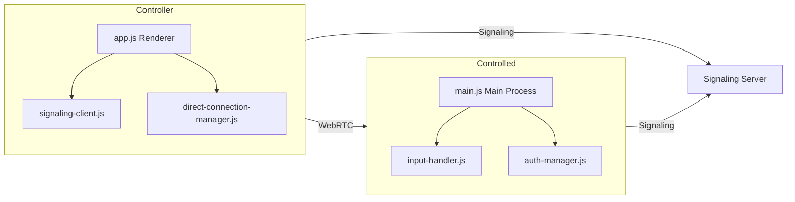
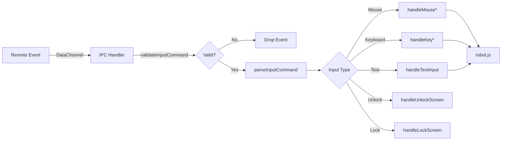
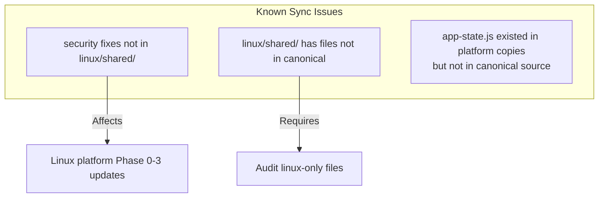

# YCDesk Architecture

YCDesk is a cross-platform remote desktop control application. This document describes its architecture, module relationships, and data flow.

## Technology Stack

| Component | Technology | Platform |
|-----------|-----------|----------|
| Desktop App | Electron + Node.js | Windows, Linux |
| Mobile App | Capacitor + Vite | Android |
| Signaling Server | Node.js + Express + Socket.IO | Windows, Linux, Docker |
| Shared Modules | Vanilla JS (ESM + CJS dual) | All |
| Input Control | robot.js (native addon) | Windows, Linux |
| Video Streaming | WebRTC + DataChannel | All |

## Project Structure

```
ycdesk/
├── shared/                    # Canonical shared modules (ESM)
│   ├── *.js                   # Core shared modules
│   ├── core/                  # App core (app-core.js)
│   ├── renderer/              # Renderer modules (app-state.js, matrix-transformer)
│   ├── utils/                 # Utilities (logger, id-generator)
│   ├── platform/              # Platform adapters (electron/android)
│   ├── managers/              # Manager modules
│   ├── gestures/              # Gesture recognition
│   ├── video/                 # Video processing
│   └── components/            # UI components
│
├── windows/                   # Windows Electron app
│   ├── src/
│   │   ├── main/              # Main process
│   │   │   ├── ipc/           # IPC handlers
│   │   │   ├── auth-manager.js
│   │   │   ├── input-handler.js (1,118 lines)
│   │   │   ├── main.js
│   │   │   └── ...
│   │   └── renderer/
│   │       ├── js/
│   │       │   └── app.js (1,453 lines)
│   │       └── css/
│   └── shared/                # Synced copy of shared/modules
│
├── linux/                     # Linux Electron app
│   ├── src/
│   │   ├── main/
│   │   │   └── input-handler.js (296 lines)
│   │   └── renderer/
│   └── shared/                # Out-of-sync copy
│
├── android/                   # Android Capacitor app
│   ├── android/               # Native Android project
│   ├── managers/
│   ├── modules/
│   └── shared/                # Synced copy of shared/
│
├── server/                    # Standalone signaling server
│   ├── server.js
│   ├── generate-cert.js
│   └── package.json
│
├── server-gui/                # GUI-wrapper signaling server
│   ├── server/                # Server module
│   └── src/                   # Electron UI
│
├── scripts/                   # Build tools
│   ├── sync-version.js
│
├── .github/workflows/         # CI/CD
│   └── ci.yml
│
└── package.json               # Root workspace
```

## Data Flow

### Remote Desktop Connection



### Shared Module Sync

```mermaid
flowchart LR
    CANONICAL[shared/ (canonical source)]
    CANONICAL -->|sync-shared.js| WIN[windows/shared/]
    CANONICAL -->|sync-shared.js| AND[android/shared/]
    CANONICAL -->|manual| LNX[linux/shared/]
    
    subgraph CANONICAL[Canonical Source]
        Core[core/]
        Managers[managers/]
        Utils[utils/]
        Platform[platform/]
        Renderer[renderer/]
    end
    
    subgraph WIN[Windows Sync]
        WIN_excludes[Excludes: core/, managers/,<br/>platform/, utils/, video/,<br/>gestures/, *.test.js]
    end
    
    subgraph AND[Android Sync]
        AND_all[All files, includes<br/>ESM export wrapper]
    end
```

### Input Processing Pipeline



## Module Descriptions

### Shared Core Modules

| Module | Description | Dependencies |
|--------|-------------|-------------|
| `config.js` | Application configuration (STUN, ports, limits) | None |
| `signaling-client.js` | WebSocket/Socket.IO signaling client | connection-state-machine |
| `connection-manager-base.js` | Base connection manager class | config, signaling-client |
| `data-channel-manager.js` | WebRTC DataChannel management | None |
| `input-protocol.js` | Input command protocol (validation, parsing) | None |
| `device-id-manager.js` | Device ID generation/storage | None |
| `app-state.js` | Observable state container | None |

### Platform-Specific Modules

| Platform | Module | Description |
|----------|--------|-------------|
| Windows | `input-handler.js` | robot.js input dispatch (1,118 lines) |
| Windows | `auth-manager.js` | Password auth + rate limiting |
| Windows | `ipc/*.js` | IPC handlers for renderer ↔ main |
| Linux | `input-handler.js` | Input handling (296 lines, lighter) |
| All | `app-core.js` | Application life cycle |

### Sync Mechanism

`windows/sync-shared.js` copies files from `shared/` to platform-specific `shared/` directories:

- **Windows sync**: Excludes core/, managers/, platform/, utils/, video/, gestures/, input-manager.js, *.test.js
- **Android sync**: All files, adds ESM `export default` wrapper for Vite compatibility
- **Linux sync**: **Not configured** — `linux/shared/` is manually maintained



## Key Technical Decisions

1. **Dual Module System**: shared/ uses ESM (`import/export`). Electron main process uses CJS (`require`). Platform copies use `window.` global pattern for renderer context. The sync-shared.js handles Android ESM adaptation.

2. **No TypeScript**: Currently vanilla JavaScript throughout. TypeScript migration is planned for Phase 6.

3. **Security Model**: AES-256-GCM + PBKDF2 for credential encryption. `timingSafeEqual` for password comparison. Rate limiting (5 attempts / 30s lockout).

4. **State Management**: Simple observable pattern in `app-state.js` with get/set/on/off. No Redux/MobX.

5. **Build System**: `pkg` (Node.js) for Windows executable, Electron Builder for desktop apps, Vite (Android) for mobile.

## CI/CD Pipeline

```mermaid
flowchart LR
    PUSH[Push to main] --> LINT[Lint: ESLint]
    PUSH --> TLINUX[Test (Linux)]
    PUSH --> TWIN[Test (Windows)]
    
    LINT --> BWIN[Build Windows]
    TLINUX --> BLINUX[Build Linux]
    
    BWIN --> ARTIFACT1[upload: ycdesk-windows-portable]
    BLINUX --> ARTIFACT2[upload: ycdesk-linux]
```

See `.github/workflows/ci.yml` for full pipeline definition.

## Development Status

| Phase | Status | Delivery |
|-------|--------|----------|
| 0: Security | ✅ Complete | 19 files modified |
| 1: Code Health | ✅ Complete | 10 files modified |
| 2: Architecture | ✅ Complete | Workspace + version sync |
| 3: Testing | ✅ Complete | Vitest + CI config |
| 4: CI/CD | ✅ Complete | GitHub Actions pipeline |
| 5: Quality | ⚠️ Partial | app-state.js added; file splitting deferred |
| 6: Evolution | 🔄 In progress | Documentation |

## See Also

- `CHANGELOG.md` — Version history and change log
- `TEST_REPORT_PHASE*.md` — Detailed test reports per phase
- `.github/workflows/ci.yml` — CI/CD pipeline definition
- `scripts/sync-version.js` — Version management tool
